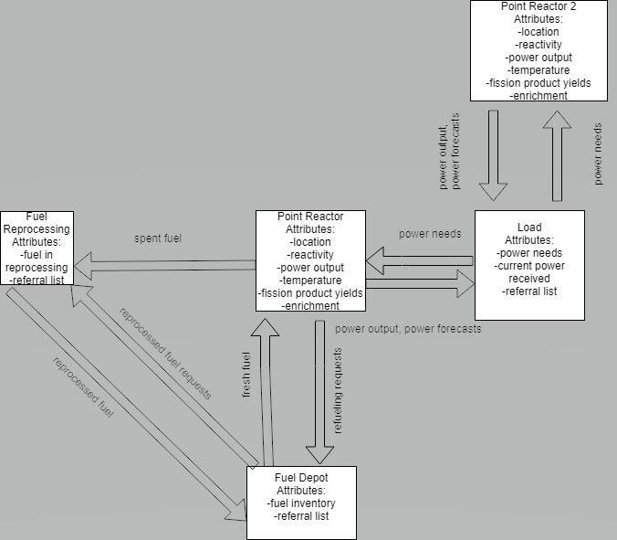

# PowerNet
A simulation of a large, dispersed electric grid powered by nuclear reactors.

Consists of...
  * Point Reactor
  * Power Load
  * Fuel Reprocessing 
  * Fuel Depot Facilities 

Linked together as [Cortix](https://cortix.org) modules.

Reactors provide power to loads and spent fuel to reprocessing facilities; the reprocessing facilities provide reprocessed fuel to depots which provide fresh and reprocessed fuels to point reactors.

This is intended to simulate the effects of station outages, power spikes and changes to availability of nuclear fuel on a real grid system, and will track material and energy usages as well as providing a model for costs, both to the end consumer and everyone along the way, from station operators to fuel reprocessers.
